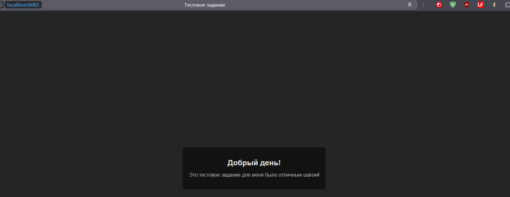
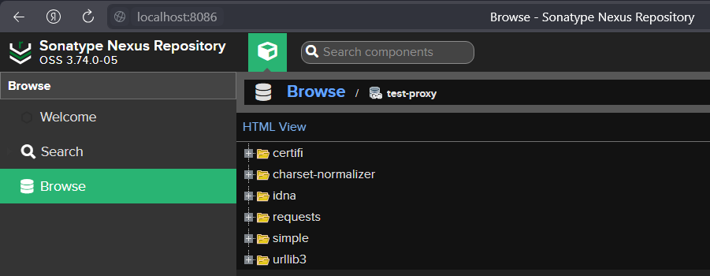
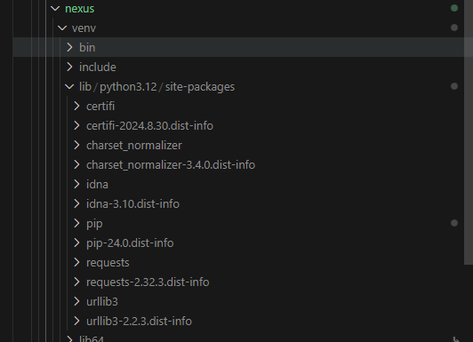
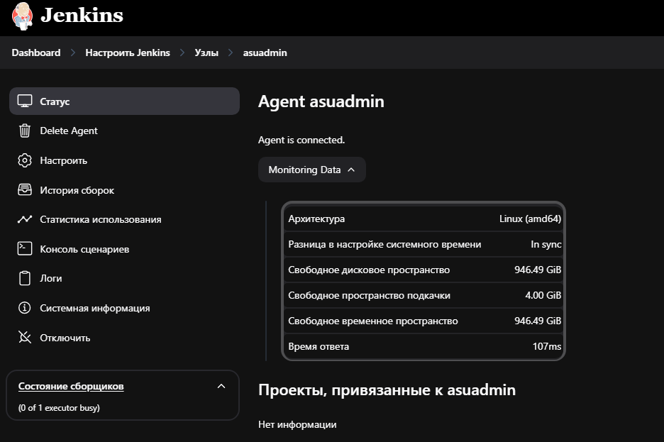

# Дополнительные задания 
<details>
<summary>
<strong style="font-size: 24px;">Задание №1</strong>
</summary>

---

+ **Написать Dockerfile, который запускает nginx и при обращении к localhost:8085 выдает страницу с приветствие "Добрый день! Это тестовое задание для меня было отличным шагом!". Разместить Dockerfile и файл index.html в GitHub в каталоге nginx.**

#### В каталоге nginx размещены все необходимые файлы.  

## Структура репозитория
```
add-tasks/
│   ├── images/
│   └── nginx/
│       ├── Dockerfile
│       ├── index.html
│       └── nginx.conf
└── 
```
nginx.conf тут нужен чтобы переопределить дефолтный порт с 80 на 8085 и указать index.html

Dockerfile
---
``` docker
FROM nginx:latest

COPY index.html /usr/share/nginx/html/index.html

COPY nginx.conf /etc/nginx/conf.d/default.conf

EXPOSE 8085

CMD ["nginx", "-g", "daemon off;"]
```
Nginx.conf
---
```nginx
server {
    listen 8085;
    server_name localhost;

    location / {
        root /usr/share/nginx/html;
        index index.html;
    }
}
```
Страница в браузере изображена ниже
---

<details>
  <summary>Скриншот работы</summary>
  <div align="center">
  
  
  
  </div>
</details>

</details>

<details>
<summary>
<strong style="font-size: 24px;">Задание №2</strong>
</summary>

---

+ **Поднять инстанс с артефакторием Nexus. Удалить стандартные репозитории и настроить proxy-репозиторий для pypi. Название для proxy-репозитория указать: test-proxy**

#### В каталоге nexus размещены все необходимые файлы.

Для выполнения этого задания также как и раньше будет попытка использовать скрипт формата "нажал на кнопку - получил результат", пришлось помучаться, но оно работает)

#### Скрипт решает следующие задачи:

+ Запуск Nexus с помощью Docker Compose;
+ Настройка админа с изменением пароля;
+ Создание прокси-репозитория для Pypi;
+ Удаление других репозиториев;
+ Создание и настройка виртуального окружения Python;
+ Проверка установки пакета через настроенный прокси-репозиторий.

#### Рассмотрим подробнее:

1. Инициализация  
Определяются необходимые переменные, такие как имя админа, новый пароль, название Docker контейнера, URL Nexus и название для прокси-репозитория.
``` bash
ADMIN_USER="admin"
NEW_PASSWORD="asuadmin"
CONTAINER_NAME="nexus"
INITIAL_PASSWORD_FILE="/nexus-data/admin.password"
NEXUS_URL="http://localhost:8086/service/rest/v1"
PROXY_REPO="test-proxy"
```
2. Запуск nexus
``` bash
echo -e "Начинаем установку..."
docker-compose up -d

echo -e "Ждём запуска Nexus..."
while ! curl -s http://localhost:8086 > /dev/null; do
    echo "Все еще ждём..."
    sleep 10
done
```
3. Дальше идет настройка пароля админа, но так как пароль уже установлен, то пропускается на данном этапе.

4. Проверка и создание репозитория

``` bash 
# Проверка того есть ли он
repository_exists() {
    local repo_name=$1
    curl -s -u "$ADMIN_USER:$ADMIN_PASS" -X GET "$NEXUS_URL/repositories/$repo_name" > /dev/null
}

# Удаление если он уже есть
echo -e "Создаём proxy-репозиторий для pypi..."
if repository_exists "$PROXY_REPO"; then
    echo "Репозиторий $PROXY_REPO уже существует. Удаляем..."
    curl -s -u "$ADMIN_USER:$ADMIN_PASS" -X DELETE "$NEXUS_URL/repositories/$PROXY_REPO"
    echo "Репозиторий $PROXY_REPO удалён."
fi

# Создание репозитория 
curl -u "$ADMIN_USER:$ADMIN_PASS" -X POST "$NEXUS_URL/repositories/pypi/proxy" \
  -H "Content-Type: application/json" \
  -d '{
    "name": "'"$PROXY_REPO"'",
    "online": true,
    "storage": {
      "blobStoreName": "default",
      "strictContentTypeValidation": true,
      "writePolicy": "allow"
    },
    "proxy": {
      "remoteUrl": "https://pypi.org/",
      "contentMaxAge": 1440,
      "metadataMaxAge": 1440
    },
    "negativeCache": {
      "enabled": true,
      "timeToLive": 1440
    },
    "httpClient": {
      "blocked": false,
      "autoBlock": true
    }
  }'
echo "Proxy-репозиторий $PROXY_REPO создан."
```

5. Удаление стандартных репозиториев

``` bash
echo -e "Удаляем стандартные репозитории..."
for repo in $(curl -s -u "$ADMIN_USER:$ADMIN_PASS" -X GET "$NEXUS_URL/repositories" | jq -r '.[].name'); do
  if [[ "$repo" != "$PROXY_REPO" ]]; then
    echo "Удаляем репозиторий: $repo"
    curl -s -u "$ADMIN_USER:$ADMIN_PASS" -X DELETE "$NEXUS_URL/repositories/$repo"
    echo "Репозиторий $repo удалён."
  fi
done
```

6. Создание виртуального окружения python и провекра настроенного репозитория

``` bash
echo -e "Создаём виртуальное окружение для Python..."
python3 -m venv venv
source venv/bin/activate

echo -e "Обновляем pip..."
pip install --upgrade pip > /dev/null

echo -e "Проверяем установку пакета через репозиторий..."
pip install --index-url http://localhost:8086/repository/test-proxy/simple/ requests > ./result.txt
```

<details>
  <summary>Скриншот работы</summary>
  <div align="center">

  

  
  
  </div>
</details>

</details>


<details>
<summary>
<strong style="font-size: 24px;">Задание №3</strong>
</summary>

---

+ **Поднять воркер(агент) для Jenkins и подключить к существующему инстансту.**

#### В каталоге jenkins размещены все необходимые файлы.

Как обычно пытаемся в автоматизацию, для выполнения задания написан docker-compose файл, который выполняет это задание.

### docker-compose.yml
``` yaml
services:
  jenkins-agent:
    image: openjdk:24-slim                      # Версия, где есть apt-get
    container_name: jenkins-agent               # Название контейнера
    working_dir: /home/jenkins/agent            # Рабочая папка
    volumes:
      - agent-work:/home/jenkins/agent/work
# Обновляемся, затем устанавливаем curl и выполняем команды, которые указаны на сайте jenkins после создания nod`ы 
    command: >
      /bin/bash -c "apt-get update &&
      apt-get upgrade -y &&
      apt-get install -y curl &&
      curl -sO ${JENKINS_URL}/jnlpJars/agent.jar &&
      java -jar agent.jar -url ${JENKINS_URL} -secret ${AGENT_SECRET} -name ${AGENT_NAME} -webSocket -workDir ${AGENT_WORKDIR}"
    networks:
      - monitoring    # Чтобы обращаться по имени контейнера jenkins
    ports:
      - "50001:50000" # Избегаем конфликта с обычным jenkins
    restart: always
volumes:
  agent-work:
networks:
  monitoring:
    external: true
```


<details>
  <summary>Скриншот работы</summary>
  <div align="center">

  
  
  </div>
</details>

</details>

<details>
<summary>
<strong style="font-size: 24px;">Задание №4-6</strong>
</summary>

+ **Написать скрипт на bash который на вход получает текстовый файл и выводит строки в которых есть слово testbash на экран и в дальнейшем формировует новый файл из всех найденных строк и подсчитывает это количество строк и также записывает в файл. Разместить скрипт в GitHub в каталоге bash**
+ **Создать нового пользователя в Linux и добавить его в группу sudo, настроить выполнение sudo без пароля**
+ **Просмотреть основные характеристики машины Linux: объем ОЗУ, количество ядер, объем HDD, файловую систему томов, релиз дистрибутива Linux**


**Для выполнения этих заданий был написан один скрипт который находится в каталоге bash.**  
**Также с помощью ~~чатгпт~~ написан файлик для того, чтобы проверить работает ли скрипт.** 


</details>

<details>
<summary>
<strong style="font-size: 24px;">Главный вопрос</strong>
</summary>
    
Главный вопрос - Для чего писать скрипты, если в задании указано сделать _вручную_, все дело в том, что я страдаю странной разновидностью лени, готов вложить всю свою энергию в создание того, что выполнит задачу за меня, даже если для этого потребуется больше работы, чем для самого дела.
</details>
