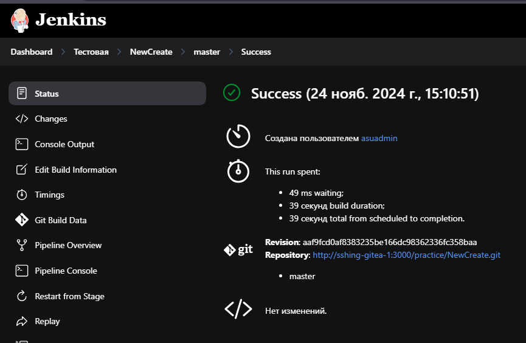
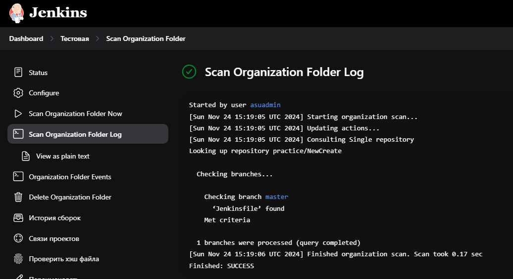
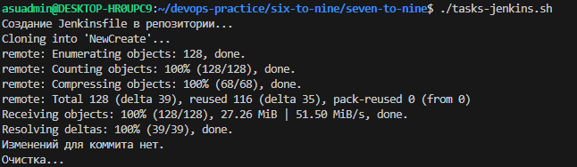
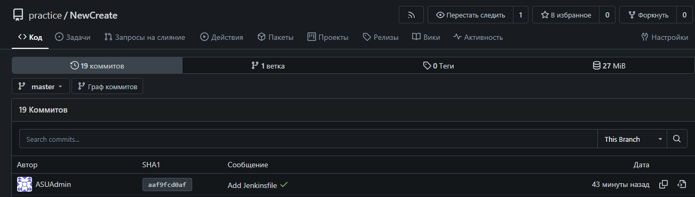
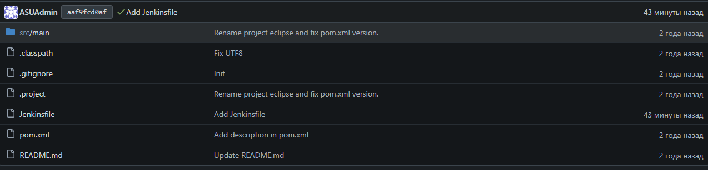

# Задание №6-8

+ **Создать организацию Тестовая в Jenkins и настроить интеграцию с Gitea организации practice**
+ **Добавить в репозиторий NewCreate Jenkinsfile, который будет собирать проект (выполняет mvn package)**
+ **Запустить сканирование организации practice в Jenkins. Убедиться, что NewCreate собирается**

Вместо тысячи слов лучше показать, что все работает - 

